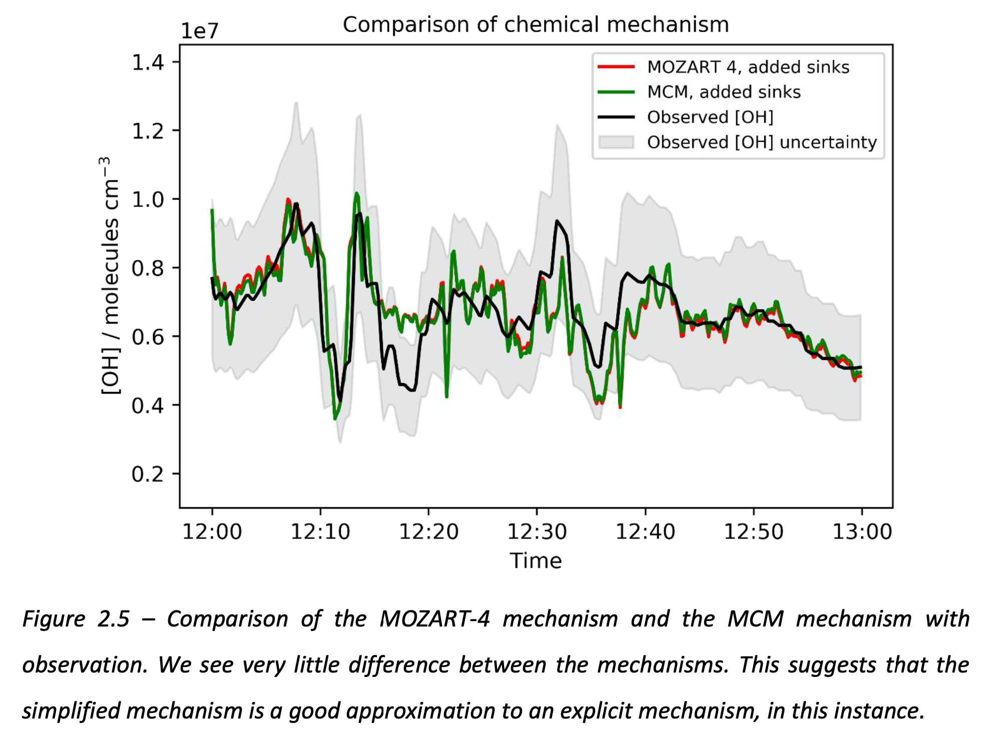
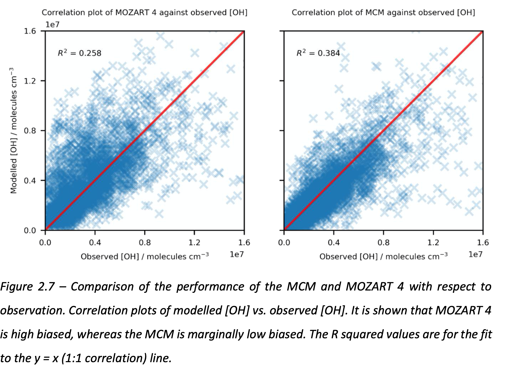

SH, and PTG, JMW, Christop Knote?, ATA in some order - JMW suggests adding YMS (lot of help initially and throughout) 

## Abstract
* making use of the ATOM data to examine effect of chemical mechanisms
* making use of ATOM data to examine effect of modelling parameters
* showing that a RR method can perform similary to MCM/MOZART4

## Introduction

Atmospheric oxidizing capacity is important but hard to estimate.  This has implications for the usefulness of chemistry-climate models - using bottom-up emissions estimates in a model with incorrect oxidising capacity (too fast/slow sinks) leads to errors in calculation of atmospheric concentrations. This has implications for other area.  For instance, improving our understanding and more accurately simulating levels of global oxidants would result in more accurate top-down emissions estimates using atmospheric inversion methods.  More accurate estimates of trace gas lifetimes would allow for better calculation of their radiative impact.

Evaluation of tropospheric OH on global scale particularly challenging: short lifetime, strong spatial and temporal variability in sources and sinks, there may be unknown sources, missing sinks in models. Partitioning between HOx species also important, requires further understanding, depends on NO, CO and emerging evidence for the importance HOx recycling processes.

Methods to estimate OH relies on box model approaches, e.g. Spivakovsky.  Box model with inputs of photolysis rates and sinks, performed over global range.   Uncertainties can be dominated by photochemical inputs (e.g. cloudiness, albedo)

Another approach is globally integrated assessments, e.g. MCF.  Uncertainties can be dominated by anciliary loss processes (e.g. unknown sinks for MCF).

These approaches have limitations, e.g. Prather estimate of CH4 lifetime.

ATOM provides new approach.  Targets whole troposphere.  Highly instrumented so provides sufficient constraint for photochemical model input and outputs.  

Paper uses these data together with a reduced-complexity CCM mechanism and a state-of-the-art explicit mechanism in a unified framework to examine the output of photochemical model and to compare with observations.

## Methods

## Results/Discussion

Figures?

